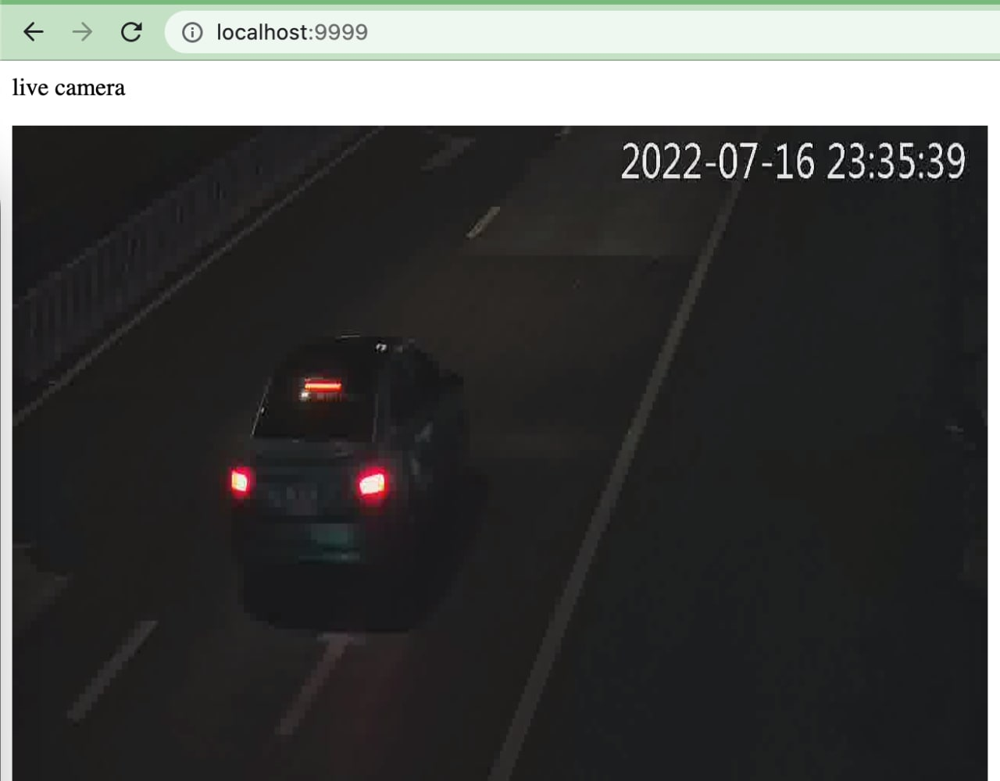

## rtps-replay example

- require install ffmpeg

### 1. install package

```js
npm install
```

### 2. edit config

Open file `index.js` and edit your rtsp url

### 3. run server

```js
node index.js
```

### 4. view camera live stream

http://localhost:9999


